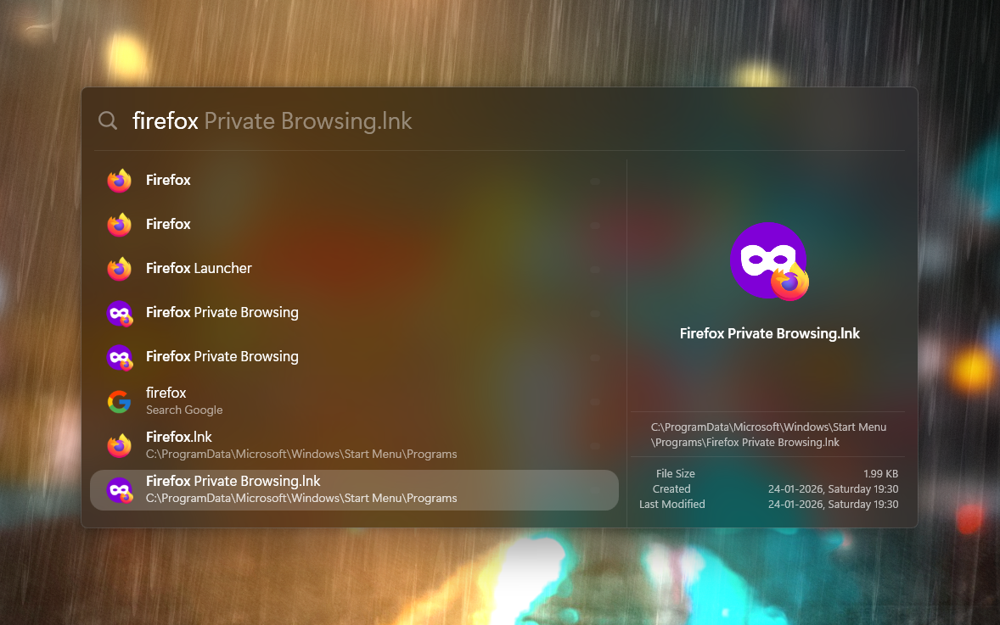
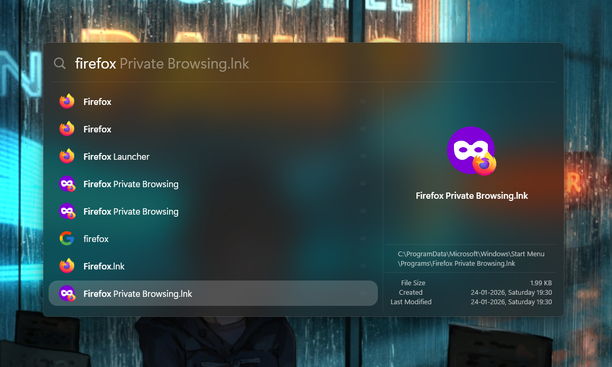
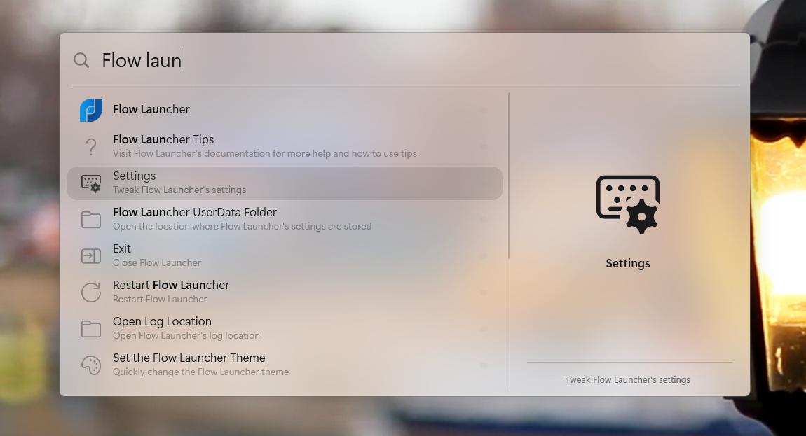
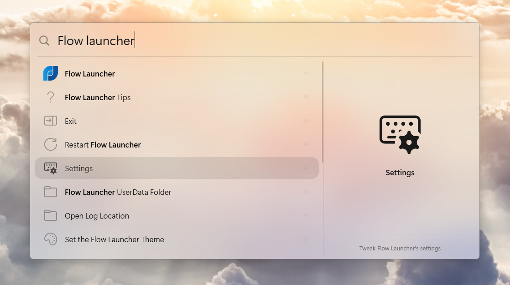

# Spotless Themes
Dark and Light themes for Flow Launcher (with clean versions).

## Previews

### Spotless Dark
Mac-inspired dark theme with optimized Gaussian blur and precise alignment.

### Spotless Dark Clean
The minimalist version. Subtitles are removed for a completely uncluttered look.

### Spotless Light
A glass-like light theme with subtle emphasis and optimized opacity to reflect your desktop background natively.

### Spotless Light Clean
The minimalist version. Subtitles are removed for a completely uncluttered look.

> [!NOTE]
> **Preview Mode:** Designed with **"Preview Always On"** in mind, but remains fully functional without the preview panel.

## Technical Details
- **Opacity:** Optimized background opacity with Gaussian blur (60% for Dark, roughly 20% for Light).
- **Font:** Optimized for `Segoe UI Variable`. Predefined in the code; no manual configuration is required if the font is installed on your system.
- **Layout - Preview Panel:** Implements a custom split to override the standard layout ratio.

## Installation
1. Download your preferred theme (Right-click and select **"Save link as..."**):
   - [**Download SpotlessDark.xaml**](https://raw.githubusercontent.com/Glct26/FlowLauncherThemes/refs/heads/main/Spotless/SpotlessDark.xaml)
   - [**Download SpotlessDarkClean.xaml**](https://raw.githubusercontent.com/Glct26/FlowLauncherThemes/refs/heads/main/Spotless/SpotlessDarkClean.xaml)
   - [**Download SpotlessLight.xaml**](https://raw.githubusercontent.com/Glct26/FlowLauncherThemes/refs/heads/main/Spotless/SpotlessLight.xaml)
   - [**Download SpotlessLightClean.xaml**](https://raw.githubusercontent.com/Glct26/FlowLauncherThemes/refs/heads/main/Spotless/SpotlessLightClean.xaml)
2. Move the file(s) to: `%APPDATA%\FlowLauncher\Themes`
3. Open Flow Launcher **Settings** -> **Appearance** -> **Theme** and select your newly installed theme.
4. Restart Flow Launcher to ensure all changes apply correctly.

## Layout Sync
To ensure the window and margins are correct, you need to sync the theme size:
1. Go to **Settings > Appearance**.
2. Click the **Pencil Icon** (top right).
3. Scroll down and click **Import Theme Size**.
